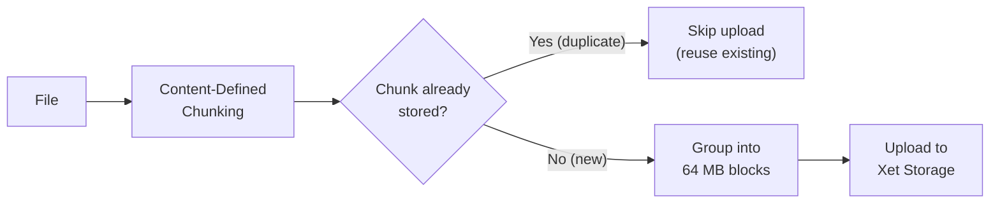

<!-- huggingface-docs: machine-translated zh-CN from English source -->

# 重复数据删除

支持 Xet 的存储库利用 [content-defined chunking (CDC)](https://huggingface.co/blog/from-files-to-chunks) 在字节级别（约 64KB 的数据，也称为“块”）进行重复数据删除。每个块都由滚动哈希来标识，该滚动哈希根据实际文件内容确定块边界，使其能够适应文件中任何位置的插入或删除。当使用支持 Xet 的客户端将文件上传到 Xet 支持的存储库时，其内容会被分解为这些可变大小的块。分块后，仅保留 Xet 存储中尚未存在的新块，其他所有内容都将被丢弃。

> [!提示]
> 块级重复数据删除也是使**服务器端副本即时**的原因：存储库和存储桶之间的`hf buckets cp`仅迁移内容哈希，无需重新上传数据。参见[Copying files between repos and buckets](../storage-buckets#copying-files-between-repos-and-buckets)。

## 内容定义分块的工作原理要理解内容定义的分块，请将文件想象为一长段文本。该系统使用滚动散列（一种滑动字节的小型数学函数）来扫描数据。每当哈希遇到特殊模式时，就会在该位置放置一个块边界。因为边界是由“内容本身”（而不是固定位置）确定的，所以相同的数据区域始终会产生相同的块，即使周围的内容发生变化也是如此。

### 为什么不使用固定大小的块？

考虑一下当您在文件中间插入少量数据时会发生什么。使用固定大小的分块，插入后的每个块边界都会发生变化，从而使所有下游块无效 - 即使大多数数据未更改：

```text
Original file, fixed 6-byte chunks:

  |The qu|ick br|own fo|x jump|s over| the l|azy do|g     |
  chunk1  chunk2 chunk3 chunk4 chunk5 chunk6 chunk7 chunk8

Insert "very " before "lazy":

  |The qu|ick br|own fo|x jump|s over| the v|ery la|zy dog|
  chunk1  chunk2 chunk3 chunk4 chunk5 chunk6 chunk7 chunk8
                                       ~~~~~~ ~~~~~~ ~~~~~~
                                        3 chunks changed!
```

尽管只插入了 5 个字节，**8 个块中的 3 个发生了变化**，因为编辑后的所有边界都移动了 5 个位置。在 64KB 块大小的实际文件中，一个小的编辑可能会使数百兆字节的块失效。

### 内容定义的分块保持边界稳定使用 CDC，边界被放置在*内容*与模式匹配的地方——而不是以固定的间隔。这意味着插入仅影响发生编辑的块。前后的块保持相同：

```text
Original file, content-defined chunks (boundaries marked by "|"):

  |The quick |brown fox |jumps over |the lazy dog|
    chunk 1     chunk 2    chunk 3     chunk 4

Insert "very " before "lazy":

  |The quick |brown fox |jumps over |the very lazy dog|
    chunk 1     chunk 2    chunk 3     chunk 4'
    (same)      (same)     (same)      (changed)
```

只有 **四块中的 1 个发生了变化** — 包含编辑的块。其他三个字节逐字节相同并且已进行重复数据删除。这就是 CDC 对于版本化数据如此有效的原因：当您更新模型检查点或将行追加到数据集时，仅需要上传和存储修改的部分。

### 从块到存储

完整的重复数据删除管道的工作原理如下：



当文件被分块时，每个块的哈希值都会根据已存储的内容进行检查。这种情况发生在多个级别：首先针对当前上传会话中已经看到的块，然后针对先前上传的元数据的本地缓存，最后通过全局重复数据删除查询针对所有 Xet 存储检查块的子集。重复的块将被完全跳过。新的块被分组为 64 MB 的块并上传。每个块在内容寻址存储 (CAS) 中存储一次，并由其哈希值作为密钥。

## 实践中的存储节省Hub 的[current recommendation](https://huggingface.co/docs/hub/storage-limits#recommendations) 将文件限制为 200 GB。如果块大小为 64KB，则 20GB 文件有 312,500 个块，其中许多块在不同版本中都保持不变。 Git LFS 旨在仅注意到文件已更改并存储该修订的全部内容。通过在块级别进行重复数据删除，Xet 后端可以仅将修改后的内容存储在文件（可能只有几 KB 或 MB）中，并安全地对跨存储库的共享块进行重复数据删除。对于模型和数据集存储库中的大型二进制文件，这可以显着缩短文件传输时间。

有关更多详细信息，请参阅[From Files to Chunks](https://huggingface.co/blog/from-files-to-chunks)和[From Chunks to Blocks](https://huggingface.co/blog/from-chunks-to-blocks)博客文章，或Low等人的[Git is for Data](https://www.cidrdb.org/cidr2023/papers/p43-low.pdf)论文。在被 Hugging Face 收购之前，它是 XetHub 的启动点。