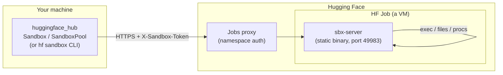

<!-- huggingface-docs: machine-translated zh-CN from English source -->

# 引擎盖下的沙箱

本指南解释了 [Sandboxes](../guides/sandbox) 的内部工作原理，以及它们为何如此构建以及它们的局限性。如果你只想使用沙箱，[Sandboxes guide](../guides/sandbox)就足够了；如果您想了解机制、评估信任模型或调试某些内容，请继续阅读。

## 没有“沙盒服务”

首先要了解的是，没有专用的沙箱后端。沙箱只是一个运行着 HTTP 协议的小型静态二进制文件 `sbx-server` 的 [HF Job](../guides/jobs)（虚拟机）。客户端通过作业代理（作业公开的`*.hf.jobs` URL）与该服务器进行通信。其他一切——身份验证、发现、将许多沙箱打包到一个作业中——都是根据现有的作业原语构建的：标签、环境变量和秘密。



这种“无新基础设施”的设计是沙箱可以在任何 Docker 镜像中工作并免费继承乔布斯的计费、硬件风格和命名空间权限的原因。

### 引导服务器

在作业启动时，作业的命令是一个小的 `/bin/sh -c` 脚本，用于获取 `sbx-server` 二进制文件，使其可执行，然后 `exec` 执行它。该二进制文件是约 640KB 的静态 [musl](https://musl.libc.org/) 构建，具有零运行时依赖性，因此它可以在任何 `x86_64` Linux 映像中运行。一些值得呼吁的决定：

- **下载，带有挂载回退。** 快速路径使用 `wget` 或 `curl`（每个常见基础映像都附带一个）从 HF CDN 下载二进制文件，速度快且免费。作为安全网，服务器的 Hub 存储库也作为卷安装在每个作业上：如果映像既没有 `wget` 也没有 `curl`，则脚本会从该安装中复制二进制文件。安装是透明的——除非实际读取，否则不需要任何成本——但读取它会增加大约 2-3 秒的冷启动时间，因此它不是默认值。对图像唯一的硬性要求是`/bin/sh`。
- **手动 HTTP/1.1 服务器，无框架。** 实时输出流需要在生成时刷新每个块。常见的最小 Rust HTTP 服务器（例如 `tiny_http`）缓冲分块响应，直到响应完成，这会中断流传输。因此，服务器手动实现 HTTP/1.1：`exec` 的 NDJSON 事件流、文件的原始主体、每个块的显式刷新。
- **端口 49983。** 服务器侦听一个故意不常见的端口，以便常见的开发端口（3000、8000、8080，...）为您自己的代码保留空闲。

> [!提示]
> 服务器在[github.com/huggingface/sandbox-server](https://github.com/huggingface/sandbox-server)开源。

## 身份验证是无状态的两个独立的层保护沙箱：

1. **代理门。** 作业代理仅转发携带对作业命名空间具有读取访问权限的 HF 令牌的请求。互联网上的随机成员无法访问该 URL。
2. **应用程序门。** `sbx-server` 还会针对每个请求检查每个沙箱 `X-Sandbox-Token`。这是深度防御：可以访问代理的只读命名空间成员仍然无法执行命令。

每个沙箱的令牌是派生的，而不是存储的：

```text
nonce  = random 128-bit hex                       # stored in the job label "hf-sandbox-nonce"
token  = HMAC-SHA256(key=your_hf_token, msg="hf-sandbox:" + nonce)
```

这意味着只有用于启动作业的 HF 代币才能访问沙箱。

每个沙箱作业还带有两个稳定的发现标签 - `hf-sandbox=1`（在所有这些标签上）和 `hf-sandbox-mode=dedicated` 或 `hf-sandbox-mode=pool` - 因此您可以在服务器端列出或过滤它们，例如`hf jobs ps --label hf-sandbox=1`。

令牌通过作业机密传递到服务器。客户端根据需要从标签中的公共随机数重新派生它。这有一些好的后果：- **无状态重新连接。** `Sandbox.connect(id)` 可在任何持有相同 HF 令牌的机器上工作 — 从标签中读取随机数，重新计算令牌。没有本地文件，没有要复制的状态。
- **HF 令牌不会作为环境变量或作业机密传递到沙箱**（除非您选择使用`forward_hf_token=True`）。这并不是硬性保证您的凭据无法访问：沙箱端口上侦听的进程是映像首先启动的进程，因此不受信任的映像可能能够观察客户端发送的请求 - 包括其 `Authorization` 标头。将可从沙箱访问的凭据视为可能暴露给它。
- **每个沙箱范围。** 每个沙箱都有一个唯一的随机数，因此泄漏的沙箱令牌只会损害该沙箱。其他命名空间成员持有不同的 HF 令牌并且无法派生它。

## 专用沙箱 (`Sandbox.create`)

简单的模型：**每个沙箱一个作业**。作业是一个真正的虚拟机，因此这提供了最强的隔离（虚拟机级别），支持包括 GPU 在内的任何硬件风格，并且是相互不信任的代码的正确选择。它的 API 路由位于 `/v1/*`，文件路径在容器文件系统上是绝对的。 `kill()` 只是取消作业。

```mermaid
sequenceDiagram
    participant U as Sandbox.create()
    participant J as Jobs API
    participant S as sbx-server (in Job)
    U->>J: run_job(image, expose 49983, labels hf-sandbox=1 + hf-sandbox-nonce, secret token)
    J-->>U: job_id + proxy URL
    U->>S: poll /health until ready (~6s VM boot)
    U->>S: POST /v1/exec  (run a command, stream NDJSON back)
    U->>J: cancel_job  (on kill / context-manager exit)
```成本就在图中：每个沙箱都要支付大约 6 秒的虚拟机冷启动费用，并对整台机器进行计费。对于单个沙箱或 GPU 工作负载来说，这正是您想要的。对于 100-1000 个短 CPU 任务来说这是一种浪费——这就是池的用途。

## 池：一项作业中有多个沙箱 (`SandboxPool`)

典型的强化学习部署或工具执行沙箱需要几 MB 的 RAM 和一个核心持续几秒钟。为每个 2 个 vCPU 的虚拟机和 6 秒的冷启动付费——并触发 1000 个虚拟机的调度突发——是错误的交易。因此，[SandboxPool](/docs/huggingface_hub/v1.29.0/en/package_reference/sandbox#huggingface_hub.SandboxPool)将一个作业作为主机运行，并在其中复用许多沙箱。

池化沙箱不是嵌套的虚拟机或容器。这是经典的 Unix 多用户原语：

- **专用 uid** (≥ 20000),
- 该 uid 拥有的 **私人 `0700` 住宅**，
- 命令`exec`'d作为具有**清理环境**的uid（`env_clear`，因此主机的秘密永远不会泄漏），`NO_NEW_PRIVS`，每个进程**rlimits**和每个沙箱**陆地锁规则集**。

因此，创建沙箱在服务器端需要 `mkdir + chown + build ruleset` ≈ 1 毫秒 — 无需第二次虚拟机启动。唯一客户端可见的延迟是代理往返。

```mermaid
flowchart TB
    Pool["SandboxPool<br/>image, flavor, sandboxes_per_host"]
    subgraph h1["Host Job #1 (one VM)"]
        S1["sbx-server"]
        b1["sbx · uid 20001 · ~/ 0700 · landlock"]
        b2["sbx · uid 20002 · ~/ 0700 · landlock"]
        b3["sbx · uid 20003 · ~/ 0700 · landlock"]
    end
    subgraph h2["Host Job #2 (one VM)"]
        S2["sbx-server"]
        b4["sbx · uid 20001 · landlock"]
        b5["sbx · uid 20002 · landlock"]
    end
    Pool --> h1
    Pool --> h2
```池化沙箱的公共 ID 是 `<host_job_id>.<local_id>`，因此 `connect`/`exec`/`kill` 就像专用沙箱一样无状态工作。池化沙箱上的`kill()`向其主机发送`DELETE`（释放插槽）；主机继续运行。

### 池中的隔离：uid + Landlock

这是池设计的关键，因此值得精确了解什么是隔离的，什么不是隔离的。

股票作业在仅映射 uid 0..65535 的用户命名空间内以 root 身份运行，并使用 seccomp 过滤器打开或不打开 `CAP_SYS_ADMIN` / `CAP_NET_ADMIN` / `CAP_NET_RAW`。这就排除了通常的重量级隔离工具：没有嵌套命名空间，没有新的挂载，没有cgroup委托（`unshare`，`mount`，写入`/sys/fs/cgroup/...`都失败）。内核提供的是 [**Landlock**](https://docs.kernel.org/userspace-api/landlock.html) (ABI 6)，这是一个 Linux 安全模块，可以让任何非特权进程限制自身及其子进程——这正是我们需要的每个沙箱边界。服务器为每个沙箱构建一个规则集； exec 子进程在运行命令之前应用 `NO_NEW_PRIVS` → `landlock_restrict_self` → rlimits → `setuid/setgid`。

将不同的 uid（自主访问控制）与 Landlock 相结合，并针对攻击受害者 B 的敌对沙箱 A 进行实时验证，得到：- ✅ A 无法读取任何进程的 `environ` → HF 和沙箱令牌永远不会在沙箱之间泄漏。
- ✅ A 无法 `SIGKILL` / `ptrace` / 读取 B 进程的内存，`setuid` 到 B 中，或读取 B 的
  `0700` 家。
- ✅ `/tmp` 和 `/dev/shm` 访问被拒绝 - 每个沙箱都被 Landlock 限制在自己的家中（其
  `TMPDIR` 指向`$HOME` 内部）。
- ✅ A 无法 `bind` TCP 端口，因此没有沙箱间 localhost 服务（出站 `connect`
  保持允许，因此互联网可以运行）。
- ✅ 跨沙箱抽象unix套接字被阻止（`LANDLOCK_SCOPED_ABSTRACT_UNIX_SOCKET`；uid
  单独的隔离并不能阻止这些）。> [!警告]
> **为什么这不能替代 VM。** Landlock + uid 隔离速度快且无特权，但它共享一个内核和一个 VM。仍然存在两个差距，只有在同一用户信任模型下才能接受：
>
> - **资源 DoS。** 如果没有 cgroup 委派，CPU/总 RAM/磁盘不会分区。 `RLIMIT_NPROC` 和 `RLIMIT_AS` 限制了每个进程的使用，但是激进的沙箱仍然可以使其邻居挨饿或引发全局 OOM 杀手。
> - **进程列表元数据。** 沙箱可以通过 `/proc`（名称、命令行）查看其他进程 - 它只是无法读取或向它们发出信号。隐藏它们需要一个 PID 命名空间，`unshare` 无法在此处创建。
>
> 简而言之：强制执行池化沙箱之间的机密性和完整性；仅共享可用性 (DoS) 和进程列表元数据。这是一个用户自己的并行工作负载的正确边界。对于相互敌对的不可信代码（或 GPU），请使用[Sandbox.create()](/docs/huggingface_hub/v1.29.0/en/package_reference/sandbox#huggingface_hub.Sandbox.create)，它为每个沙箱提供了自己的虚拟机。

### 池中的文件模型由于池化沙箱的唯一可写区域是其受 Landlock 限制的主目录（也是其默认工作目录），因此文件 API 根该主目录中的每个路径：`files.write("data/in.txt", ...)` 写入`$HOME/data/in.txt`，前导 `/` 相对于主目录，而 `..` 无法转义它。通过 API 写入的文件会被 `chown`ed 到沙箱的 uid，以便沙箱自己的代码可以读取它们。这提供了一个干净的“植根于沙箱的文件系统”模型，该模型与沙箱内的代码可以接触的内容完全匹配，并且与专用沙箱不同，专用沙箱的路径在容器文件系统上是绝对的。

### 矿池没有权威的本地状态

池故意不是本地配置文件。池是其运行的主机作业的集合，所有作业共享一个`hf-sandbox-pool=<id>`标签。这使池与沙箱 API 的其余部分保持一致（所有内容都可以从标签中发现，并且可以从任何计算机重新附加），这意味着一旦最后一个主机消失，池就会停止存在。- 主机在其作业环境变量中携带池的配置（图像、风格、`sandboxes_per_host`、空闲超时）——标签仅用于过滤。当客户端必须启动重复主机时，它会从正在运行的主机 (`inspect_job`) 读取该配置，因此池中的所有主机都保持一致，无需中央记录。
- 环境和秘密是每个沙箱的，在创建时传递 - 绝不是池级别的。任何秘密都不会存储在主机上或保存在本地磁盘上。
- 容量是服务器权威的。主机拒绝创建超过`sandboxes_per_host`（回复`{"rejected": N}`）；客户端将溢出打包到另一台主机上或启动副本。即使多个进程同时创建到同一个池中，这也能保持打包的精确性。
- 闲置驱逐分为两级。每个沙箱在其自己的`idle_timeout`不活动后都会被驱逐（除非它仍然有正在运行的进程）；一旦主机没有用于主机空闲超时的沙箱，它就会自行关闭——即使每个客户端都消失了，这也是计费的后盾。

### 尽力而为的缓存使 `create --pool` 保持快速没有权威的本地状态对于正确性来说很有好处，但会带来延迟。否则，一个冷的`hf sandbox create --pool <id>`（一个新的CLI进程）必须在创建沙箱之前重新发现网络上的所有内容：`list_jobs`扫描命名空间→`inspect_job`每个主机重建其URL和随机数→`GET /v1/sandboxes`查看每个主机的完整程度→最后`POST`创建。每次调用都会有几次往返的纯开销。

`$HF_HOME/sandbox/pools/<pool-id>.json` 的尽力而为缓存可以消除该问题。在任何创建/预热之后，进程会记录池配置以及每个主机的代理 URL、身份验证随机数和最后看到的空闲插槽。下一个进程直接从文件重建主机传输（无 HTTP）并直接进入`POST`。

```mermaid
flowchart TD
    start["hf sandbox create --pool ID"] --> rc{"cache hit?<br/>$HF_HOME/sandbox/pools/ID.json"}
    rc -- "yes (warm)" --> seed["rebuild host transport<br/>from cached URL + nonce<br/>(no HTTP)"]
    seed --> post["POST /v1/sandboxes"]
    post -- "ok" --> done["sandbox ready<br/>(~1 round-trip)"]
    post -- "host gone / full" --> slow
    rc -- "no / corrupt / stale" --> slow["fallback: list_jobs +<br/>inspect_job + GET (the cold path)"]
    slow --> post2["POST /v1/sandboxes"] --> done2["sandbox ready<br/>+ refresh cache"]
```

缓存之所以安全，正是因为它永远不会被信任为事实：- **永远不是事实的来源。** 工作中的服务器在容量方面保持权威，因此过时的 `live` 计数只会导致浪费的请求，而不是正确性。
- **自我修复。** 已消失的缓存主机将在第一个失败的请求上被删除，并从文件中删除；创建过程透明地退回到标签发现。
- **并发安全。** 在文件锁下写入合并（由 `job_id` 键控）并原子提交，因此并行 `create` 进程不会相互干扰，并且读者永远不会看到半写入的文件。
- **一次性。** 删除它，损坏它，或者从从未见过池的机器上运行 - 这只是一个缓存未命中，冷路径运行，并且一切仍然有效。它永远不会在机器之间共享。

缓存只会让事情变得更快，永远不会变慢：最坏的情况正是原始标签发现路径。

## 性能

所有数字都是根据 `cpu-basic` 上的真实 HF 作业进行测量的，客户端位于笔记本电脑上，所有流量都流经作业代理。

**专用沙箱：**|公制|价值|
| ------------------------------------------------- | --------------------------------------------------------------------------- |
|冷启动（`create()`返回，服务器应答）|中值 ~5.8 秒 |
| `run()` 往返 | p50 ~110ms（代理 RTT 下限为 ~105ms；客户端开销 ≈ 0）|
|文件传输（并行范围，>8 MiB）|下降约 340 MiB/s，上升约 441 MiB/s |

**池（共享/主机模式）：**

| N个沙箱|主机（50/主机）|提供+创造一切|执行所有 |杀死所有 |总计 |
| ----------- | ---------------- | ---------------------- | ----------- | -------- | --------- |
| 100 | 100 2 | 6.1秒| 1.5秒| 0.6秒| **8.2秒** |
| 1000 | 1000 20 | 7.4秒| 4.2秒| 4.2秒| **15.8 秒** |在约 16 秒内创建、执行和终止 1000 个沙箱，大约需要一台主机冷启动（约 6 秒），所有沙箱均摊成本 — 总计约为 **$0.0009**（20 × `cpu-basic`），而每个沙箱一个作业的 1000 个虚拟机调度突发约为 0.06 美元。服务器端创建/执行/删除每个〜1ms；预算完全是网络往返。

## 设计决策，回顾

|决定|为什么|
| ---------------------------------------------------------------------------------- | ------------------------------------------------------------------------------------------- |
|以就业为基础，无新服务 |继承计费、硬件、权限；适用于任何图像 |
|静态 Rust 二进制文件，在启动时下载 |没有Python/pip；大约 6 秒的冷启动 vs 基于 pip 的引导程序的 30-90 秒 |
|手卷HTTP/1.1 |最小框架缓冲分块响应并中断实时流传输（已验证）||无状态 HMAC 身份验证 |从任何地方重新连接；每个沙箱范围的令牌而不是 HF 令牌 |
| `run()` 在非零退出时加注（`check=False` 选择退出）| “运行代码，查看错误”循环的最佳 DX（E2B 样式）|
| `idle_timeout` 看门狗代替客户端清理 |持久沙箱是一项功能；泄密者仍死不瞑目
| Pools = uid + Landlock，服务器权威能力，无本地状态 |快速同用户扇出；并发下正确；可在任何地方重新安装|

### Git 与 HTTP 范例
https://huggingface.co/docs/huggingface_hub/v1.29.0/concepts/git_vs_http.md