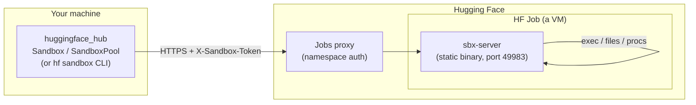
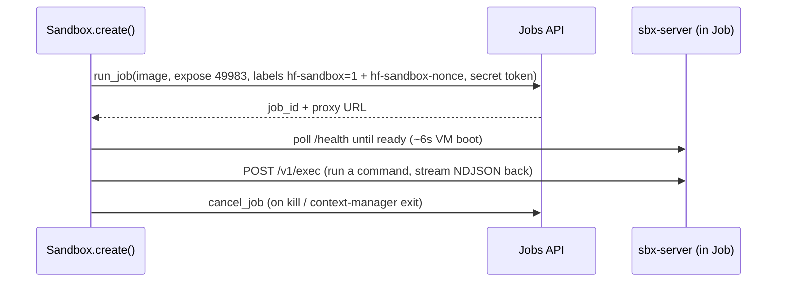
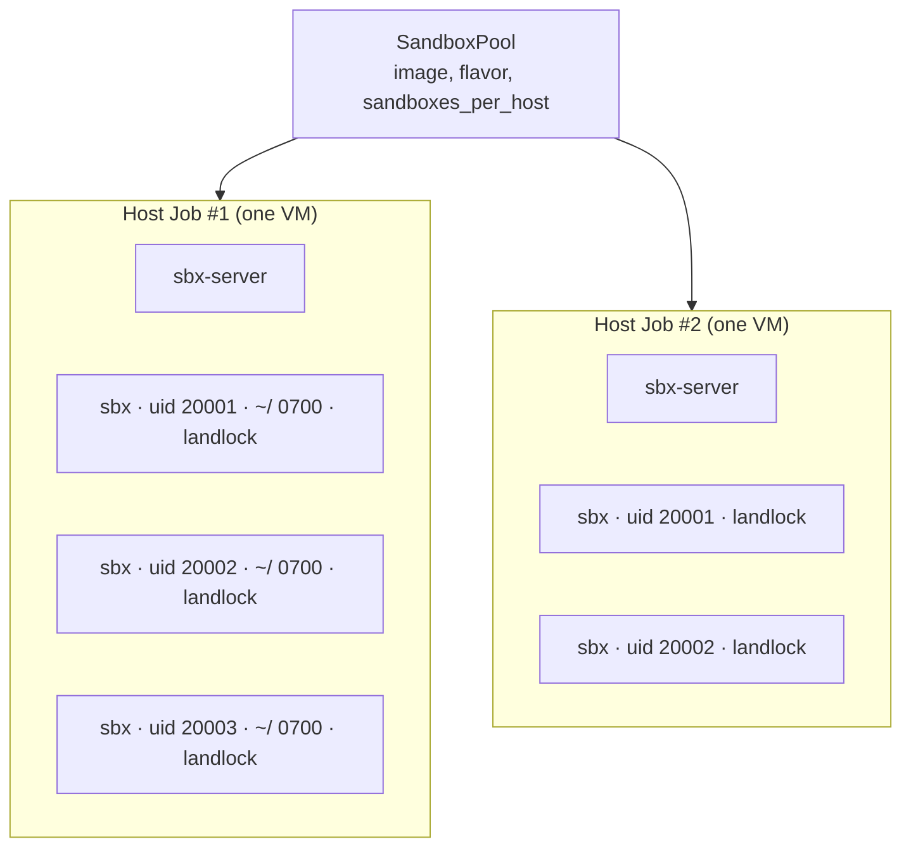
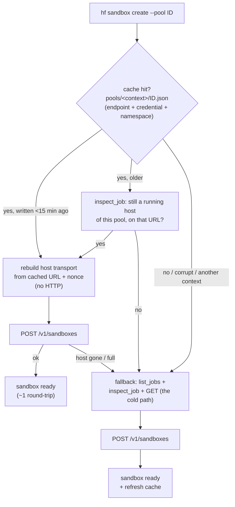

<!-- huggingface-docs: machine-translated zh-CN from English source -->

# 引擎盖下的沙箱

本指南解释了 [Sandboxes](../guides/sandbox) 的内部工作方式、它们为何如此构建以及它们的局限性。如果你只想使用沙箱，[Sandboxes guide](../guides/sandbox)就足够了；如果您想了解机制、评估信任模型或调试某些内容，请继续阅读。

> [!注意]
> 沙箱 API 是实验性的。其 API 和行为可能会更改，恕不另行通知。

## 没有“沙盒服务”

首先要了解的是，没有专用的沙箱后端。沙箱只是一个运行着 HTTP 协议的小型静态二进制文件 `sbx-server` 的 [HF Job](../guides/jobs)（虚拟机）。客户端通过作业代理（作业公开的`*.hf.jobs` URL）与该服务器进行通信。其他一切——身份验证、发现、将许多沙箱打包到一个作业中——都是根据现有的作业原语构建的：标签、环境变量和秘密。



这种“无新基础设施”的设计是沙箱可以在任何 Docker 镜像中工作并免费继承乔布斯的计费、硬件风格和命名空间权限的原因。

### 引导服务器在作业启动时，作业的命令是一个小的 `/bin/sh -c` 脚本，用于获取 `sbx-server` 二进制文件，使其可执行，然后 `exec` 执行它。该二进制文件是约 640KB 的静态 [musl](https://musl.libc.org/) 构建，具有零运行时依赖性，因此它可以在任何 `x86_64` Linux 映像中运行。

一些值得呼吁的决定：

- **下载，带有挂载回退。** 快速路径使用 `wget` 或 `curl`（每个常见基础映像都附带一个）从 HF CDN 下载二进制文件，速度快且免费。作为安全网，服务器的 Hub 存储库也作为卷安装在每个作业上：如果映像既没有 `wget` 也没有 `curl`，则脚本会从该安装中复制二进制文件。安装是透明的——除非实际读取，否则不需要任何成本——但读取它会增加大约 2-3 秒的冷启动时间，因此它不是默认值。对图像唯一的硬性要求是`/bin/sh`。
- **手动 HTTP/1.1 服务器，无框架。** 实时输出流需要在生成时刷新每个块。常见的最小 Rust HTTP 服务器（例如 `tiny_http`）会缓冲分块响应，直到响应完成，这会中断流传输。因此，服务器手动实现 HTTP/1.1：`exec` 的 NDJSON 事件流、文件的原始主体、每个块的显式刷新。- **端口 49983。** 服务器侦听一个故意不常见的端口，以便常见的开发端口（3000、8000、8080，...）为您自己的代码保留空闲。

> [!提示]
> 服务器在[github.com/huggingface/sandbox-server](https://github.com/huggingface/sandbox-server)开源。

## 身份验证是无状态的

两个独立的层保护沙箱：

1. **代理门。** 作业代理仅转发携带对作业命名空间具有读取访问权限的 HF 令牌的请求。互联网上的随机成员无法访问该 URL。
2. **应用程序门。** `sbx-server` 还会在除 `/health` 之外的每个请求上检查 `X-Sandbox-Token` 标头。这是深度防御：可以访问代理的只读命名空间成员仍然无法执行命令。

沙箱令牌是派生的，而不是存储的：

```text
nonce  = random 128-bit hex                       # stored in the job label "hf-sandbox-nonce"
token  = HMAC-SHA256(key=your_hf_token, msg="hf-sandbox:" + nonce)
```

随机数是公开的，HMAC 密钥是您的 HF 令牌，因此持有该令牌的任何机器都可以重新计算沙箱令牌 - 这正是使重新连接成为无状态的原因。这也意味着令牌是从您的凭据派生的“功能”，而不是对调用者的身份检查：服务器验证调用者是否知道令牌，而不是他们是谁。每个沙箱作业还带有两个稳定的发现标签 - `hf-sandbox=1`（在所有这些标签上）和 `hf-sandbox-mode=dedicated` 或 `hf-sandbox-mode=pool` - 因此您可以在服务器端列出或过滤它们，例如`hf jobs ps --label hf-sandbox=1`。

令牌通过作业机密传递到服务器。客户端根据需要从标签中的公共随机数重新派生它。这有一些好的后果：

- **无状态重新连接。** `Sandbox.connect(id)` 可在任何持有相同 HF 令牌的机器上工作 — 从标签中读取随机数，重新计算令牌。没有本地文件，没有要复制的状态。
- **HF 令牌不会作为环境变量或作业机密传递到沙箱**（除非您选择使用`forward_hf_token=True`）。这并不是硬性保证您的凭据无法访问：沙箱端口上侦听的进程是映像首先启动的进程，因此不受信任的映像可能能够观察客户端发送的请求 - 包括其 `Authorization` 标头。将可从沙箱访问的凭据视为可能暴露给它。

### 令牌范围每个**作业**都会生成一个随机数，因此派生的令牌是一个*作业*凭证。在专用模式下，工作是沙箱，因此两者是一致的。在池模式下，作业是主机，主机拥有许多沙箱 - 因此池化沙箱会获得自己的第二个更窄的凭证：

|资质证书 |如何导出|授权|
| ---| ---| ---|
| **专用沙箱令牌** |工作标签中的`HMAC(hf_token, nonce)` |那个沙箱（这是整个工作）|
| **池主机令牌** |来自主机作业标签的`HMAC(hf_token, nonce)` |池管理：在该主机上创建、列出和删除沙箱，并恢复其令牌 |
| **池化沙箱代币** |随机 256 位，由每个沙箱的主机服务器铸造 |那个沙箱——不是兄弟，也不是池|

客户端自动使用窄的：`pool.create()`在创建响应中接收它，`Sandbox.connect("<host>.<id>")`使用主机令牌恢复它，`proxy_headers`分发沙箱的令牌而不是主机的令牌（在您读取它的那一刻解析HF承载，因此长期存在的句柄不会分发过时的句柄） - 这些标头通常最终出现在浏览器或WebSocket客户端中，因此他们应该授予对一个沙箱的访问权限，仅此而已。这对于泄漏意味着什么：**池化沙箱令牌**会损害该沙箱。 **主机令牌**会损害主机 - 主机上的每个沙箱（当前和未来）以及其管理路由 - 因此请将其视为池的管理凭据。您的命名空间的成员持有不同的 HF 令牌，无法派生您的令牌，但请参阅 [Known limitations](#known-limitations) 了解如何将令牌“传递”到错误的位置。

> [!注意]
> 在推出期间，主机服务器仍然接受每个沙箱路由上的主机令牌，因此
> 早于每个沙箱令牌的客户端继续工作。那是管理资格证
> 到达它创建的沙箱；沙箱凭证永远无法到达同级凭证。

## 专用沙箱 (`Sandbox.create`)

简单的模型：**每个沙箱一个作业**。作业是一个真正的虚拟机，因此这提供了最强的隔离（虚拟机级别），支持包括 GPU 在内的任何硬件风格，并且是相互不信任的代码的正确选择。它的 API 路由位于 `/v1/*`，文件路径在容器文件系统上是绝对的。 `kill()` 只是取消作业。专用沙箱为您提供的边界位于**作业与其外部的所有内容**之间。在虚拟机内部，您的代码和 `sbx-server` 都以 root 身份在同一个容器中运行：`sbx-server` 不会沙箱它为您运行的命令，它仅通过 HTTP 公开它。因此，一旦您不信任的代码在专用沙箱中执行，请将该虚拟机（包括其控制平面）视为属于该代码：它可以杀死或替换服务器，然后您在该沙箱中执行的任何操作都将受到其摆布。每个不受信任的工作负载使用一个专用沙箱，并在完成后使用`kill()`，而不是跨信任边界重复使用一个沙箱。



成本就在图中：每个沙箱都要支付大约 6 秒的虚拟机冷启动费用，并对整台机器进行计费。对于单个沙箱或 GPU 工作负载来说，这正是您想要的。对于 100-1000 个短 CPU 任务来说这是一种浪费——这就是池的用途。

## 池：一项作业中有多个沙箱 (`SandboxPool`)> [!警告]
> **池用于一个信任边界内的工作负载。** 池化沙箱是一个 uid + 一个 Landlock
> 共享虚拟机内的规则集，而不是其自己的虚拟机，并且其主机运行特权控制平面
> 它的所有沙箱都与之对话。使用池以低廉的成本扇出“您自己的”代码。为了互相
> 不信任工作负载 — 任何您不允许读取其他沙箱文件的内容 — 使用
> [Sandbox.create()](/docs/huggingface_hub/v2.0.0/en/package_reference/sandbox#huggingface_hub.Sandbox.create)，它为每个工作负载提供了自己的虚拟机。参见
> [Known limitations](#known-limitations) 了解具体差距。

典型的 RL 部署或工具执行沙箱需要几 MB 的 RAM 和一个核心持续几秒钟。为每个 2 个 vCPU 的虚拟机和 6 秒的冷启动付费——并触发 1000 个虚拟机的调度突发——是错误的交易。因此，[SandboxPool](/docs/huggingface_hub/v2.0.0/en/package_reference/sandbox#huggingface_hub.SandboxPool)作为主机运行一个作业，并在其中复用许多沙箱。

池化沙箱不是嵌套的虚拟机或容器。这是经典的 Unix 多用户原语：

- **专用 uid** (≥ 20000),
- 该 uid 拥有的 **私人 `0700` 住宅**，
- 命令`exec`'d作为具有**清理环境**的uid（`env_clear`，因此主机的秘密永远不会泄漏），`NO_NEW_PRIVS`，每个进程**rlimits**和每个沙箱**内锁规则集**。因此，创建沙箱在服务器端需要 `mkdir + chown + build ruleset` ≈ 1 毫秒 — 无需第二次虚拟机启动。唯一客户端可见的延迟是代理往返。



池化沙箱的公共 ID 是 `<host_job_id>.<local_id>`，因此 `connect`/`exec`/`kill` 就像专用沙箱一样无状态工作。池化沙箱上的`kill()`向其主机发送`DELETE`（释放插槽）；主机继续运行。

### 池中的隔离：uid + Landlock

这是池设计的关键，因此值得精确了解什么是隔离的，什么不是隔离的。

股票作业在仅映射 uids 0..65535 的用户命名空间内以 root 身份运行，并使用 seccomp 过滤器打开或不打开 `CAP_SYS_ADMIN` / `CAP_NET_ADMIN` / `CAP_NET_RAW`。这就排除了通常的重量级隔离工具：没有嵌套命名空间，没有新的挂载，没有cgroup委托（`unshare`，`mount`，写入`/sys/fs/cgroup/...`都失败）。内核提供的是 [**Landlock**](https://docs.kernel.org/userspace-api/landlock.html) (ABI 6)，这是一个 Linux 安全模块，可以让任何非特权进程限制自身及其子进程——这正是我们需要的每个沙箱边界。服务器为每个沙箱构建一个规则集； exec 子进程会在运行命令之前放入沙箱 uid/gid 并应用 `NO_NEW_PRIVS`、`landlock_restrict_self` 和 rlimits。将不同的 uid（自主访问控制）与 Landlock 相结合经过设计和测试，可提供：

- ✅ A 无法读取另一个进程的`environ`，从而阻止沙箱之间直接访问 HF 和沙箱令牌。
- ✅ A 无法`SIGKILL` / `ptrace` / 读取 B 进程的内存、`setuid` 到 B 中，或读取 B 的进程
  `0700` 家。
- ✅ `/tmp` 和 `/dev/shm` 访问被拒绝 - 每个沙箱都被 Landlock 限制在自己的家中（其
  `TMPDIR` 指向`$HOME` 内部）。
- ✅ A 无法 `bind` TCP 端口，因此没有沙箱间 localhost 服务（出站 `connect`
  保持允许，因此互联网可以运行）。
- ✅ 跨沙箱抽象unix套接字被阻止（`LANDLOCK_SCOPED_ABSTRACT_UNIX_SOCKET`；uid
  单独的隔离并不能阻止这些）。

这些控制限制了工作量。根控制平面仍然是一个单独的信任边界：其主机模式文件操作拒绝符号链接，其套接字代理固定套接字 inode 并检查对等 uid，并且专用路由在主机模式下不可用。剩余共享通道在[Known limitations](#known-limitations)中描述。> [!注意]
> **为什么这不能替代虚拟机。** Landlock 和 uid 隔离适用于同一虚拟机内的工作负载
> 信任边界。由于池化沙箱共享内核、虚拟机和控制平面，因此可以保护每个人
> 不保证跨沙箱攻击；资源和一些进程列表元数据也保持共享。为了互相
> 不受信任的代码，或者对于 GPU，使用[Sandbox.create()](/docs/huggingface_hub/v2.0.0/en/package_reference/sandbox#huggingface_hub.Sandbox.create)，它为每个沙箱提供了自己的 VM。

### 池中的文件模型

由于池化沙箱的唯一可写区域是其受 Landlock 限制的主目录（也是其默认工作目录），因此文件 API 根该主目录中的每个路径：`files.write("data/in.txt", ...)` 写入`$HOME/data/in.txt`，前导 `/` 相对于主目录，而 `..` 无法转义它。通过 API 写入的文件会被 `chown`ed 到沙箱的 uid，以便沙箱自己的代码可以读取它们。这提供了一个干净的“植根于沙箱的文件系统”模型，该模型与沙箱内的代码可以接触的内容完全匹配，并且与专用沙箱不同，专用沙箱的路径在容器文件系统上是绝对的。路径按词法标准化，然后相对于每个组件上的符号链接拒绝的开放主目录描述符进行解析。文件 API 不遵循符号链接，包括同一主目录内的链接；沙箱代码仍然可以在其 Landlock 规则下使用它们。

### 矿池没有权威的本地状态

池故意不是本地配置文件。池是其运行的主机作业的集合，所有作业共享一个`hf-sandbox-pool=<id>`标签。这使池与沙箱 API 的其余部分保持一致（所有内容都可以从标签中发现，并且可以从任何计算机重新附加），这意味着一旦最后一个主机消失，池就会停止存在。- 主机在其作业环境变量中携带池的配置（图像、风格、`sandboxes_per_host`、空闲超时）——标签仅用于过滤。当客户端必须启动重复主机时，它会从正在运行的主机 (`inspect_job`) 读取该配置，因此池中的所有主机都保持一致，无需中央记录。
- 环境和秘密是每个沙箱的，在创建时传递 - 绝不是池级别的。池化沙箱的环境在沙箱的生命周期内保存在主机服务器的内存中（它会重新应用于您运行的每个命令）；它永远不会写入磁盘，也不会出现在任何作业的元数据中。池化沙箱没有加密秘密通道 - 使用 `env` 并将这些值视为“未静态，但也未加密”。对于需要加密存储的值，请使用专用沙箱的`secrets`。
- 容量是服务器权威的。主机拒绝创建超过`sandboxes_per_host`（回复`{"rejected": N}`）；客户端将溢出打包到另一台主机上或启动副本。即使多个进程同时创建到同一个池中，这也能保持打包的精确性。- 闲置驱逐分为两级。每个沙箱在其自己的`idle_timeout`不活动后都会被驱逐（除非它仍然有正在运行的进程）；一旦主机没有针对主机空闲超时的沙箱，它就会自行关闭——即使每个客户端都消失了，这也是计费的后盾。

### 尽力而为的缓存使 `create --pool` 保持快速

没有权威的本地状态对于正确性来说很有好处，但会带来延迟。否则，一个冷的`hf sandbox create --pool <id>`（一个新的CLI进程）必须在创建沙箱之前重新发现网络上的所有内容：`list_jobs`扫描命名空间→`inspect_job`每个主机重建其URL和随机数→`GET /v1/sandboxes`查看每个主机的完整程度→最后`POST`创建。每次调用都会有几次往返的纯开销。

`$HF_HOME/sandbox/pools/<context>/<pool-id>.json` 处的尽力而为缓存可以消除该问题。在任何创建/预热之后，进程会记录池配置以及每个主机的代理 URL、身份验证随机数和最后看到的空闲插槽。下一个进程直接从文件重建主机传输（无 HTTP）并直接进入`POST`。`<context>` 是端点、凭证和条目写入的命名空间的摘要——凭证作为指纹；您的令牌本身永远不会写入缓存。目录名和文件都携带它，并且在所有三个上都不匹配的读取是普通的缓存未命中，因此计算机的另一个用户、另一个端点或 `connect(pool, namespace="other-org")` 获取冷路径，而不是为其他内容缓存的主机。创建文件`0600`，创建目录`0700`。



缓存的可信和不可信用途：- **在容量上不具有权威性。** 正在运行的服务器保持权威性，因此过时的 `live` 计数只会导致浪费的请求，而不会导致错误打包的主机。
- **不受主机所在位置的信任。** 仅当缓存 URL 是具有相同条目名称的作业的 HTTPS 作业代理 URL 时，才会使用缓存 URL，因此缓存文件无法选择您的 HF 承载和沙箱令牌发送到的目的地；命名任何其他内容的条目将从文件中删除。过去 15 分钟，条目也不再单独记入：`inspect_job` 必须确认作业仍在运行，仍然标记为该池，并且在构建传输之前仍然位于该 URL 上。
- **其形状不受信任。** 类型和范围在读取时进行检查，因此手动编辑、截断或字符串类型的文件是缓存未命中，而不是通过`create()`的中途错误。
- **自我修复。** 已消失的缓存主机将在第一个失败的请求上被删除，并从文件中删除；创建过程透明地退回到标签发现。
- **并发安全。** 在文件锁下写入合并（由 `job_id` 键控）并原子提交，因此并行 `create` 进程不会相互干扰，并且读者永远不会看到半写入的文件。- **一次性。** 删除它，您会遇到缓存未命中：冷路径运行，一切仍然有效。它永远不会在机器之间共享。

有两件事要记住。将 `$HF_HOME` 视为敏感：条目仍然是可重用的主机 URL 加上其令牌派生的公共随机数，并且虽然忽略使用不同凭据写入的文件，但在 *yours* 下写入的文件将在上面的 15 分钟窗口中记入。由于命名空间是键的一部分，因此只有在传递相同的 `namespace=` 时才会再次找到缓存在显式 `namespace=` 下的池 — `hf sandbox create --pool <id>` 需要与创建池时使用的相同的 `--namespace`，或者它采用冷路径并在您自己的命名空间中查找。

## 已知限制

**池适用于一个信任边界内的工作负载。对您不信任的代码使用专用沙箱。** 以下检查可降低特定风险；他们不会将池化沙箱转变为单独的虚拟机。

### 威胁模型一览|演员 |专注|泳池|
| ---| ---| ---|
|匿名互联网用户 |作业代理需要具有命名空间读取访问权限的 HF 令牌。 |相同的。 |
|具有读取权限的命名空间成员 |可以访问代理和公共健康检查，但需要沙箱令牌才能进行 API 操作。 |相同的。 |
|可以创建职位的命名空间成员 |无法从另一个用户的随机数中派生出其令牌。 |可以复制池标签，但默认采用会检查作业 API 的发起者。 `adopt_hosts="namespace"` 选择信任其他创作者。 |
|沙箱中运行的代码 |与VM内的服务器共享root；不要跨信任边界重复使用该虚拟机。 |受 uid 和 Landlock 限制，但共享内核、VM 和特权控制平面。 |
|您的客户 |持有 HF 和专用沙箱凭证。 |持有主机管理凭据和单独的每个沙箱功能。 |

### 隔离和资源差距- **主机发现不是证明。** 默认 `adopt_hosts="own"` 检查启动器、图像、风格、命令和公开的 URL。它不会证明正在运行的二进制文件或使可变图像值得信赖。仅将 `adopt_hosts="namespace"` 与您信任的命名空间成员一起使用。
- **主机凭据仍然强大。** 他们管理池并恢复每个沙箱的令牌。服务器还在兼容性窗口期间在作用域路由上接受它们（`SBX_COMPAT_HOST_TOKEN=0`禁用该回退）。
- **保留共享通道。** 出站 TCP、对控制服务器的环回访问、UDP、内核 IPC 和可读进程列表元数据未隔离。系统目录和选定的设备节点仍然可访问。 GPU 池隔离未经测试；使用 GPU 专用模式。
- **限制不是聚合配额。** 每个进程的 rlimits 和有界输出队列减少了资源放大。它们不会在沙箱之间划分 CPU 份额、总内存、磁盘空间、索引节点或网络容量。目录分页限制响应，但仍然在服务器上具体化目录。 API 文件写入不是磁盘配额，并且专用模式对特殊文件的写入可能会被阻止。- **限制可以被显式削弱。** 主机模式默认需要 Landlock ABI 6 并拒绝失败的规则集。降低 `SBX_MIN_LANDLOCK_ABI` 或使用服务器的 `--allow-unconfined` 开发标志接受较少的保证；检查经过验证的 `/health` 的有效 ABI 和功能。
- **代理连接仅验证一次。** 在第一个请求之后，代理将字节复制到该后端，直到 EOF。该连接上的后续 HTTP 请求不会独立进行身份验证或路由。 WebSocket/SSE 兼容性并未建立针对上游连接重用的安全性。

### 生命周期和凭证- **分离的后代可以比进程终止或超时更长。** 两者都向进程组发出信号；称为 `setsid()` 的后代逃离了该群体。删除池沙箱或终止专用作业以结束整个工作负载。
- **`max_hosts` 是尽力而为。** 单独的客户端可以对相同的主机进行计数，并且都配置更多。硬共享上限需要后端准入或幂等性。
- **拆卸可能会失败。** 失败的主机取消会引发并保留缓存记录。 `close()` 限制其等待进行中创建的时间；比等待更持久的创作可以留下可计费的工作。使用作业 API 或 CLI 来协调运行资源。
- **承载轮换不会轮换沙箱功能。** 代理身份验证会解析每个请求的当前 HF 令牌，但无状态重新连接会从确切的原始承载值派生主机令牌。轮换该值可以防止重新连接到现有主机。
- **本地缓存保留可信输入 15 分钟。** 检查其 URL 和安全上下文，但没有完整性 MAC；保护 `$HF_HOME` 免受不受信任代码的写入。- **摘要 pin 没有签名来源。** 客户端验证一个特定的服务器二进制文件。发布和更新该 pin 仍然是发布步骤；工作流程的清单不是加密证明。仅当两个哈希工具都丢失时，显式的 `SBX_ALLOW_UNVERIFIED_SERVER=1` 转义舱口才会跳过验证。

未经身份验证的`/health`仅公开活性和协议。详细的元数据需要主机凭据。沙箱 ID 和令牌需要内核随机源； UID 重复使用遵循经过验证的流程和家庭清理。

## 性能

所有数字都是根据 `cpu-basic` 上的真实 HF 作业进行测量的，客户端位于笔记本电脑上，所有流量都流经作业代理。

**专用沙箱：**|公制|价值|
| ------------------------------------------------- | --------------------------------------------------------------------------- |
|冷启动（`create()`返回，服务器应答）|中值 ~5.8 秒 |
| `run()` 往返 | p50 ~110ms（代理 RTT 下限为 ~105ms；客户端开销 ≈ 0）|
|文件传输（并行范围，>8 MiB）|下降约 340 MiB/s，上升约 441 MiB/s |

**池（共享/主机模式）：**

| N个沙箱 |主机（50/主机）|提供+创造一切|执行所有 |杀死所有 |总计 |
| ----------- | ---------------- | ---------------------------------- | ----------- | -------- | --------- |
| 100 | 100 2 | 6.1秒| 1.5秒| 0.6秒| **8.2秒** |
| 1000 | 1000 20 | 7.4秒| 4.2秒| 4.2秒| **15.8 秒** |在约 16 秒内创建、执行和终止 1000 个沙箱，大约需要一台主机冷启动（约 6 秒），所有沙箱均摊成本 — 总计约 **$0.0009**（20 × `cpu-basic`），而每个沙箱一个作业的 1000 个虚拟机调度突发约为 0.06 美元。服务器端创建/执行/删除每个〜1ms；预算完全是网络往返。

## 设计决策，回顾

|决定|为什么|
| ---------------------------------------------------------------------------------- | --------------------------------------------------------------------------------------------------- |
|以就业为基础，无新服务 |继承计费、硬件、权限；适用于任何图像 |
|静态 Rust 二进制文件，在启动时下载 |没有Python/pip；大约 6 秒的冷启动 vs 基于 pip 的引导程序的 30-90 秒 |
|手卷HTTP/1.1 |最小框架缓冲分块响应并中断实时流传输（已验证）||无状态 HMAC 身份验证 |从任何地方重新连接；派生代币而不是 HF 代币本身（每个作业的范围 - 请参阅[Token scope](#token-scope)）|
| `run()` 在非零退出时加注（`check=False` 选择退出）| “运行代码，查看错误”循环的最佳 DX（E2B 样式）|
| `idle_timeout` 看门狗代替客户端清理 |持久沙箱是一项功能；泄密者仍死不瞑目
| Pools = uid + Landlock，服务器权威能力，无本地状态 |快速同用户扇出；并发下正确；可在任何地方重新安装|

### Git 与 HTTP 范例
https://huggingface.co/docs/huggingface_hub/v2.0.0/concepts/git_vs_http.md